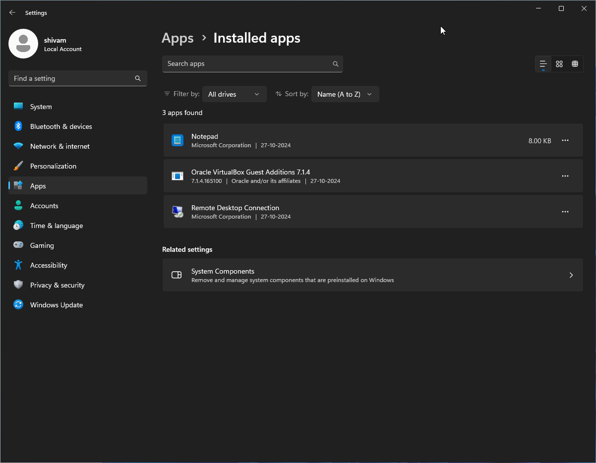
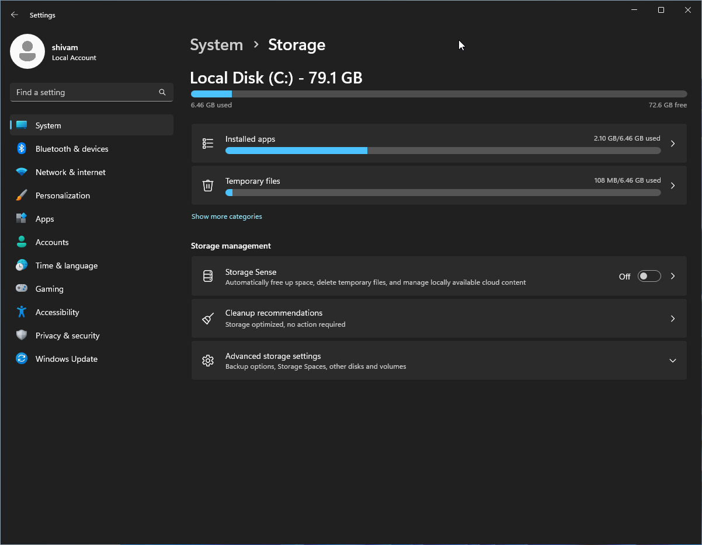
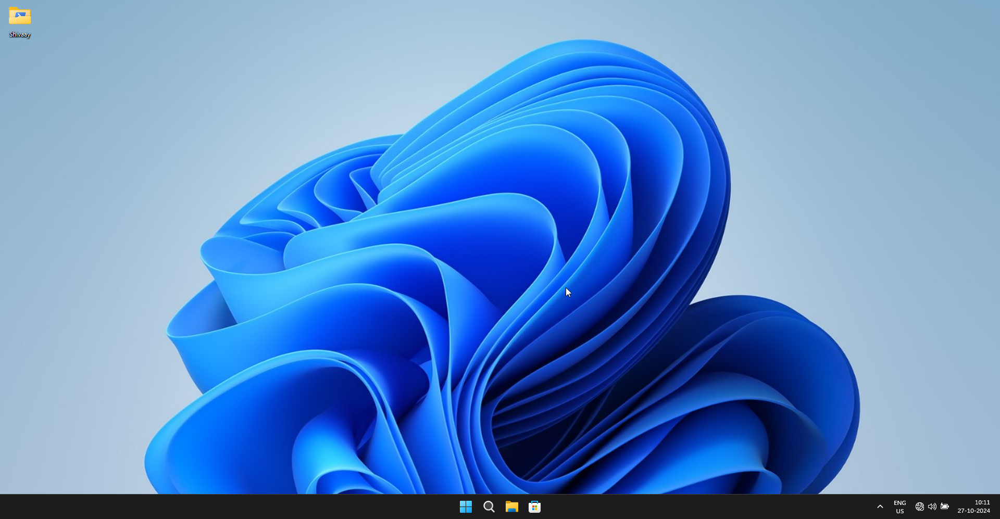
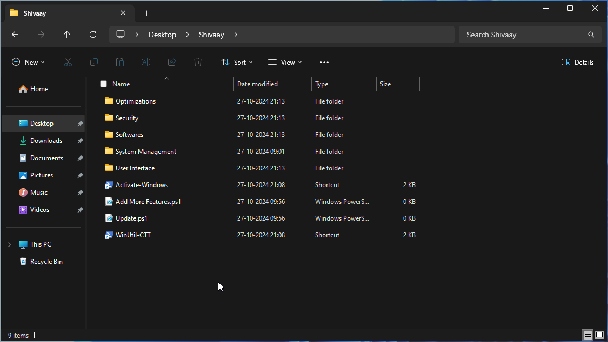
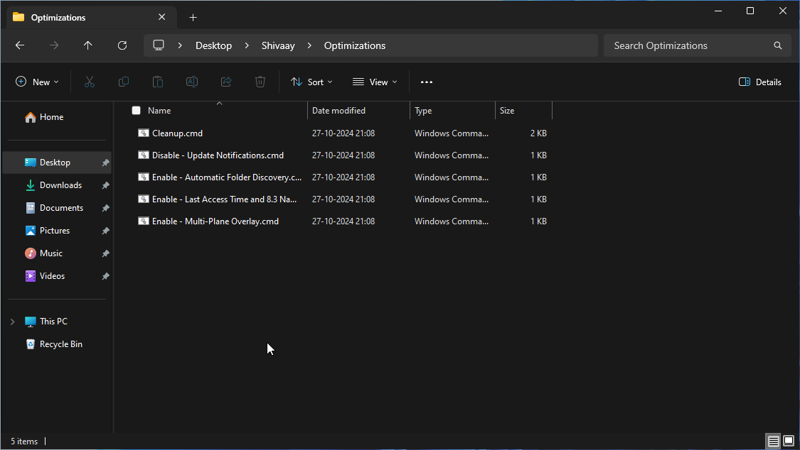
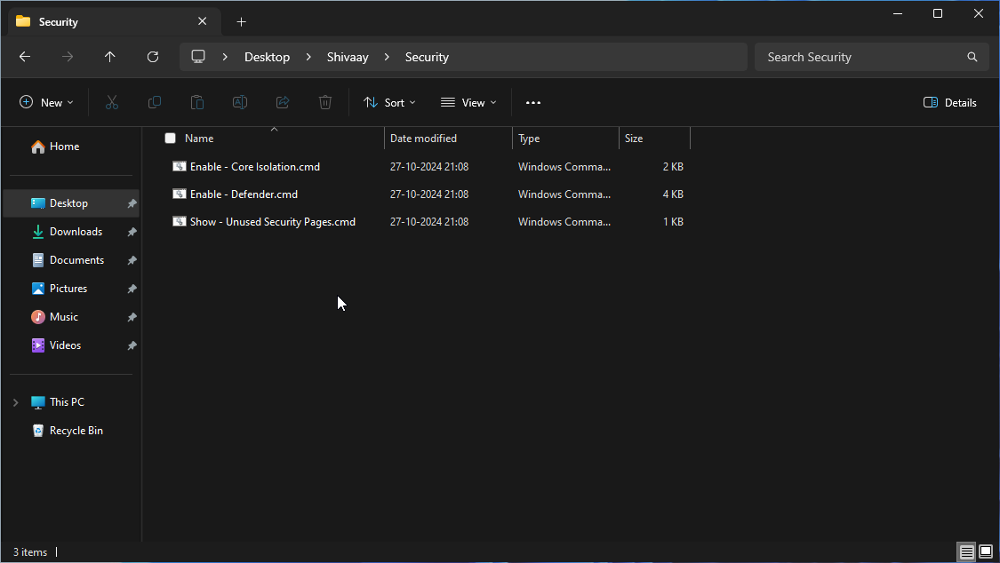
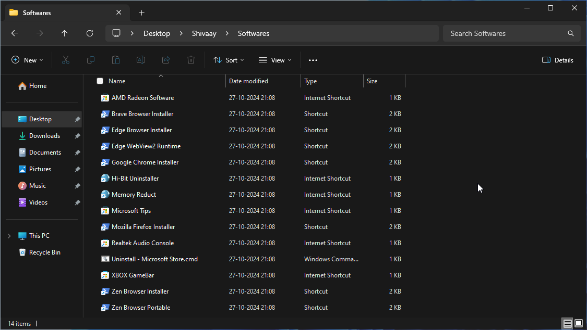
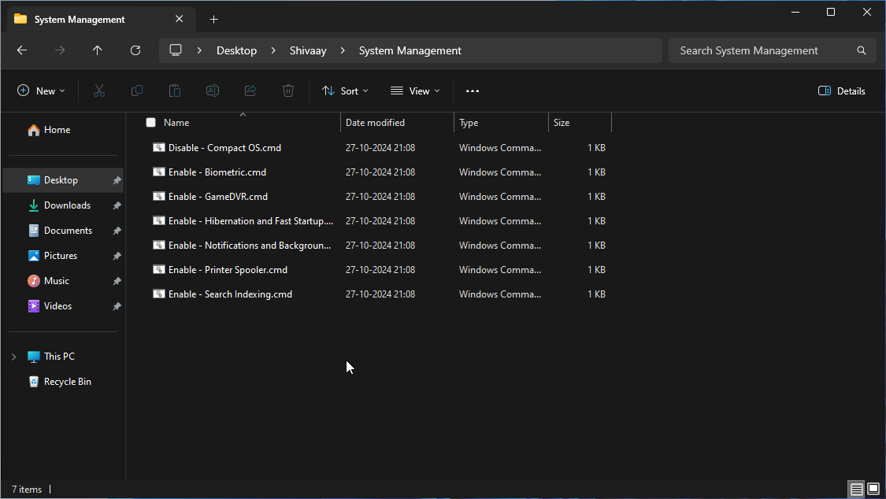
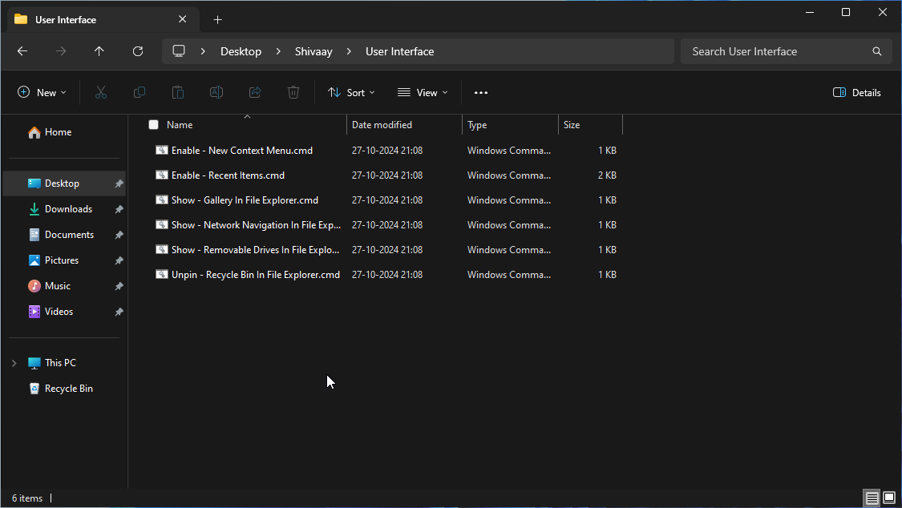

# 🔮 Optimize Windows
[](https://github.com/ShivamXD6/Optimize-Windows/releases/latest)
[](https://github.com/ShivamXD6/Optimize-Windows/releases/latest)
[](https://github.com/ShivamXD6/Optimize-Windows/blob/main/LICENSE)

[]()
[](https://t.me/flaxcubegaming)
[](https://discord.gg/gw3cRp6xBw)  
[](https://github.com/ShivamXD6/Optimize-Windows/compare)

 - This repository contains an Answer File and Some Scripts designed to optimize and streamline your Windows installation, making it ideal for gaming, power users, and even low-end laptops or PCs. 🎮💻
 - For existing Windows and if you don't want to reinstall then it's recommended to use [WinUtil by CTT.](https://github.com/ChrisTitusTech/winutil)

## 📑 Table of Contents

- [📂 Included Script](#-included-script)
- [🚀 Features](#-features)
- [❓ What to choose for installation](#-what-to-choose-for-installation)
- [🔧 Installation with Ventoy](#-installation-with-ventoy)
- [🔧 Installation with Rufus](#-installation-with-rufus)
- [📸 Screenshots](#-screenshots)
- [💖 Acknowledgements](#-acknowledgements)

## 📂 Included Scripts
### Auto Unattend or Answer File

 - Automates Windows installation with optimized settings, debloating or tweaking Windows etc.
 - Ideal for new setups or reinstalling Windows.
 
### Add More Features Script

 - Expands the Shivaay Folder with additional tweaks or customization options.
 - Perfect for enhancing personalization and system performance.

### Update Script

 - Fetches and applies the latest updates from the Optimize-Windows repository.
 - Keeps your system configurations and tweaks up to date effortlessly.

## 🚀 Features
### 1. **🚀 While Installation of Windows**
- 🚧 Bypass Windows 11 Requirements
- 🌐 Support for Local Account During Setup
- 🗂️ Show All Available Windows Editions
- 💾 Support Automatic Offline Driver Installation
- ⚙️ Auto OOBE Setup
- 🚀 Improve Windows Installation Speed

### 2. **💨 Debloat & Optimization**
- 🧹 Remove Windows Bloatware
- ❌ Disable Error Reporting, Delivery Optimization, and Remote Assistance
- 🚀 Various Services Optimization
- 🚫 Disable Automatic File Discovery
- 🎮 Turn on Game Mode and Hardware GPU Acceleration
- 💿 Dynamically Adjust Virtual Ram upto 16GB
- 🌟 Configure Visual Effects for Snappy Experience
- 🤖 Debloat Copilot and Disable Recall

### 3. **🔐 Privacy & Security**
- 👁️ Disable Telemetry and Tracking
- 🔔 Display Camera On/Off Notification
- 🔒 Configure Windows Update: Security Updates by 7 Days and Features Updates by 6 Months from Broad Updates Channel
- 🔒 Prevent Installation of Dev Home, New Outlook, Chat, Bitlocker Auto-Encryption
- 🔒 Disabled UAC (irritating for some users,although can be enabled manually later)

### 4. **👤 User-Based Customizations**
- 📁 Hide Gallery and Network Navigation (In File Explorer)
- 🔄 Hide Removable Drives (In File Explorer)
- ✔️ Enable item Check boxes in file explorer to quickly select files or folders by mouse.
- ♻️ Pin Recycle bin In File Explorer.
- ⚙️ Hide Homepage(In Settings)
- 🛡️Hide Unused Security Pages(In Windows Security)
- 📊 Show More Details on File Transfer
- 🖥️ Enable Verbose Status Messages
- 🔤 Use Full App Name on Desktop Shortcuts
- 🖇️Add 'Compress to' in Old Context Menu
- 👮 Add 'Run as Administrator' for PowerShell scripts Context Menu

### 5. **🛑 Disable Components/Services**
- 💤 Disable Hibernation and Reserved Storage
- 🖨️ Disable Printer Spooler
- 🔍 Disable Search Indexing
- 🛡️ Disable Defender, Core Isolation and Smart Screen
- 🔒 Disable Biometrics (Fingerprint and Face Unlock)
- 📀 Set SysMain (SuperFetch/Prefetch) to Manual not required for many SSD Users
- ⏫ Disable Delivery Optimization (to avoid corrupted updates being downloaded or sharing of bandwidth)

### 6. **📂 Shivaay's Folder Options**
- Everything which have "*" are only available in Add More Features Script. Not available by default to make folder less cluttered.

#### 🔐 **Security**
- 🛡️ Toggle Windows Defender, SmartScreen and Core Isolation
- 🛡️ *Toggle Unused Security Pages

#### 📦 **Software**
- This are Links/Internet-Shortcuts to install them, doesn't included any of them by Default.
- 🎮 Game Bar (Without Xbox Bloats)
- 🔴 *AMD Radeon Software (Without Bloats, also not available in Microsoft Store search)
- 💡 *Microsoft Tips (Fixes Safe Mode and Troubleshooting)
- 🎧 *Realtek Audio Console (As it's not available in Microsoft search)
- 🌐 Edge Webview (Some Apps Requires)
- ♻️ *Hi-Bit Uninstaller (Free and good for fully uninstalling any app)
- 📂 Microsoft Store (To uninstall/install it again)
- 🌐 Various Browsers like Edge, Chrome, Firefox, Brave and Zen (Normal + Portable)
- 💽 *Memory Reduct (Like sysinternals but Lightweight)

#### 🛠️ **System Management**
- 💤 Toggle Hibernation, Fast Startup
- 🖨️ *Toggle Printer Spooler
- 📵 Toggle Notifications and Background Apps
- 🔍 Toggle Search Indexing
- 🎥 Toggle GameDVR
- 🔒 *Toggle Biometrics (Fingerprint and Face Unlock)
- 💿 *Toggle Compact OS (Free up space by compressing Windows Binaries)
- 📝 *Configure Shivaay OS (Like change OS name, Folder Location etc)

#### ⚡ **Optimizations**
- 🔔 Toggle Update Notification
- 🔄 *Toggle Automatic Folder Discovery, 8.3 Char Name, Last Access Time, Multi-Plane Overlay
- 🧹 Cleanup Script to clean unnecessary files and free up space
- 💽 *Toggle Superfetch/Prefetch
- ⏬ *Toggle Delivery Optimization

#### 🖥️ **User Interface**
- 🖼️ Toggle Gallery and Home
- 📁 *Toggle Network Pane and Removable Drives in File Explorer
- ♻️ *Pin/Unpin Recycle bin in file explorer
- 📜 Toggle Recent Items (Recent Apps, Recent Documents, Files etc)
- 🔄 *Toggle Windows Old/New Context Menu

#### 🎛️ ***Context Menu**
- 🔑 Add/Remove Get File Hash
- 🔋 Add/Remove Select Performance Mode

#### 🚪 ***Useful Shortcuts**
- 🗄️ Open God Mode
- 🏁 Open Startup Programs
- 📀 Open Apps Data
- 🔁 Restart to Bios Settings, Safe mode or Normal Mode

### 7. **🔄 Miscellaneous**
- 🖥️ Create Internet Shortcuts in Shivaay Folder of CTT Winutil, Activate Windows, Add more features and Update Script.
- ⚡ Added a Custom Power Plan (Shivaay - Power Within)
- 🛑 Disable Auto Restart on BSOD (To Capture Detailed Logs)

## ❓ What to choose for installation?
> [!TIP]  
> **Ventoy** is recommended for users who don't frequently format their USB drives or want to include drivers during installation.  
> **Rufus**, on the other hand, is ideal for those who prefer a quick and simple installation and don't mind formatting the drive and installing drivers afterward.

## 🔧 Installation with Ventoy

### 1. Prepare Your USB Drive
1. Create a bootable USB drive using [Ventoy](https://ventoy.net/).
2. Download the [Optimize-Windows.zip](https://github.com/ShivamXD6/Optimize-Windows/releases/latest/download/Optimize-Windows.zip).
3. Extract the contents of `Optimize-Windows.zip` into your USB drive.
4. Confirm that the file structure on your USB drive matches the following:

    ```plaintext
    D: (Your USB-Drive)
    │
    ├───$WinpeDriver$
    │   └───Add or Export Your Drivers Here
    │
    ├───ventoy
    │   │───ventoy.json
    │   └───autounattend.xml
    │
    └───WinISO
        └───Add Your Windows ISO Here
    ```

5. Add your Windows ISO into WinISO, then Move on to Next Section.

> [!NOTE]
> Only Official Windows 10/11 ISO are supported. 

### 2. Optional: Adding Drivers
1. Create a folder named `Drivers` on your C: drive.
2. Backup your current Windows drivers to the C: drive by running the command in command prompt as administrator:

    ```cmd
    dism /online /export-driver /destination:C:\Drivers
    ```

3. Plug your USB drive/installation media into your computer.
4. Copy the drivers you want to automatically install from `C:\Drivers` to `D:\$WinpeDriver$`.

> [!NOTE]
> Drivers should be placed in their respective subfolders with `.inf` files included. `.exe` driver files are not supported.

### 3. Installing Windows via Ventoy
> [!TIP]
> Don't connect to internet or lan cable while installing.

1. Now Restart into Boot Selection Menu (By Pressing F12, F9, or ESC Repeatedly).
2. Select your USB Drive.
3. If it Says "Verification Failed: (0x1A) Security Violation" Then, Follow this, or Simply Disable secure boot from BIOS:-


4. Now Select `Boot in Normal Mode`.
5. Now you'll see some commands running.
6. Select Your Language, Region and Windows Version.

> [!NOTE]
> If you don't see many Windows versions, click **Back** once, then click **Next** again. This should display all available Windows versions.

7. You'll be Redirected to Custom Installation. Now Do any one method according to your condition.

-  If you want to keep your data :- Just select partition where your windows is installed and click next. Don't delete any other partition.

- If you want to Clean Install :- Delete all partitions. Then select Unallocated Space and click Next.

> [!NOTE]
> If installation failed it's recommended to use Rufus method given below. As 24H2 having new setup issues with Ventoy.

8. Proceeed Installation as usual windows Installation.
9. Now windows will run some more commands and restart.
10. Done Enjoy :)

## 🔧 Installation with Rufus

### 1. Prepare Your USB Drive
1. Create a bootable USB drive using [Rufus](https://rufus.ie).

> [!IMPORTANT]
> Don't tick any options while making bootable drive
> 

2. Download the [autounattend.xml](https://github.com/ShivamXD6/Optimize-Windows/releases/latest/download/autounattend.xml).
3. Now you have two ways:-

#### Short way (Recommended if you're directly installing it on Main Machine)
 1. Move the downloaded `autounattend.xml` to your Rufus USB drive (the one containing `setup.exe`)

#### Long way (Recommended Only if you want to test it out on VM)
 1. Download [AnyBurn](https://anyburn.com/download.php).
 2. Open and click on `Edit Image`
 3. Select Windows ISO.
 4. Click on `Add` at Top Left Corner.
 5. Select `autounattend.xml`
 6. Click Next, and Modify name to something else to keep original ISO Untouched.
 7. Done, now test it on VM or Directly Use it on Rufus.
 
> [!NOTE]
> Only Official Windows 10/11 ISO are supported. 
 
### 2. Installing Windows via Rufus
> [!TIP]
> Don't connect to internet or lan cable while installing.

1. Now Restart into Boot Selection Menu (By Pressing F12, F9, or ESC Repeatedly).
2. Select your USB Drive.
3. Now you'll see some commands running.
4. Select Your Language, Region and Windows Version.

> [!NOTE]
> If you don't see many Windows versions, click **Back** once, then click **Next** again. This should display all available Windows versions.

7. You'll be Redirected to Custom Installation. Now Do any one method according to your condition.

-  If you want to keep your data :- Just select partition where your windows is installed and click next. Don't delete any other partition.

- If you want to Clean Install :- Delete all partitions. Then select Unallocated Space and click Next.

8. Proceeed Installation as usual windows Installation.
9. Now windows will run some more commands and restart.
10. Done Enjoy :)
 
## 📸 Screenshots

### 🧪 Benchmarks

- On Original Windows


- On Windows with Answer File


### 💻 Process Count, RAM, Installed Apps and Storage Usage

- On Original Windows


- On Windows with Answer File






> [!NOTE]
> These have been tested on a VM (VirtualBox), not on the main machine; therefore, the results may be slightly different on the main machine.

### 🖥️ Desktop & Shivaay Folder

- On Original Windows


- On Windows with Answer File















## 💖 Acknowledgements
 - Thanks to [MemTechTips](https://github.com/memstechtips/UnattendedWinstall) for Core file Used as a base for Answer File.
 - Credits to [Atlas](https://atlasos.net), [ChrisTitusTech](https://github.com/ChrisTitusTech/winutil) and [Revi](https://revi.cc) for Tweaks used in this answer File.
